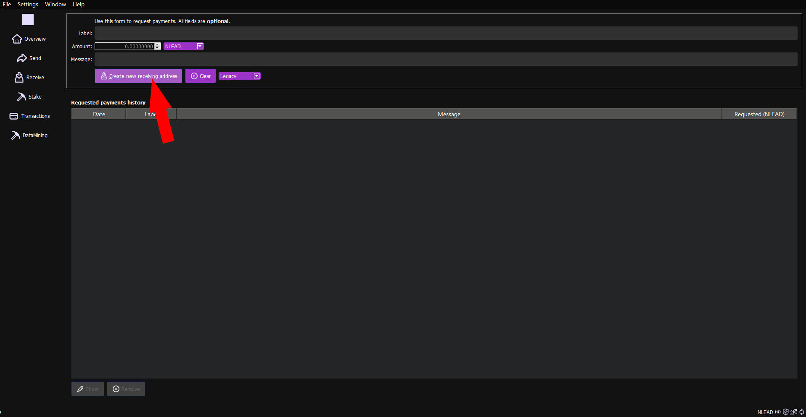
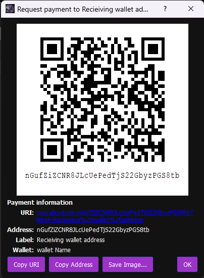
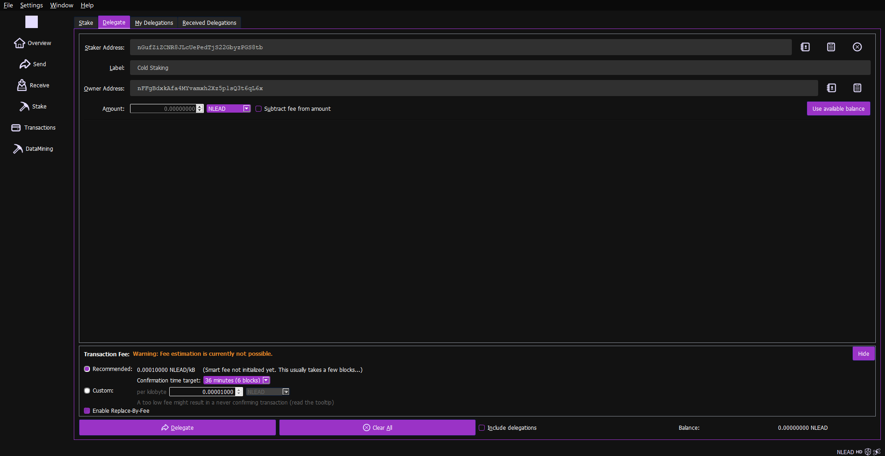
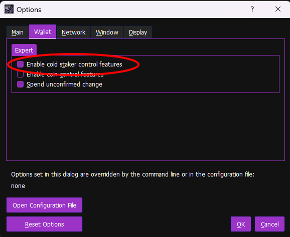
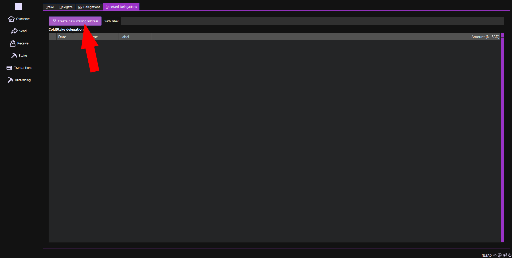

# NeuralLeadCoin Cold Staking How-To

__Cold staking involves two NeuralLeadCoin wallets:__
- one to hold the funds (this can be also a hardware wallet and does not need to be always online)
- one to handle the staking, the hot-node, (this needs to be online 24/7)

<p>In order to setup cold-staking, you need to perform the following steps (either with the command line interface, or with the graphical interface):</p>

1) [Get the address from cold-staking service provider](#1) (an address owned by the party providing the cold staking service).

2) [Generate an address to act as the owner of the delegations](#2) (a regular address, you should have one already).

3) [Delegate the coins](#3). (main step of the process)

4) [Finish](#4). (wait for the staking to begin)

- [Staker extra controls](#staker)
- [Additional RPC functions](#rpc)

<br>

### 1) <a name="1"></a>Get the address from cold-staking service provider

Find a cold-staking service provider and ask for their staking address.
This looks like a regular address; the cold-staking service provider will be using the funds in this address in the staking process, trying to find the next blocks in the chain.

As example, the <b>NeuralLeadCoin Official ColdStaking Address</b> is:
> <b>nPHQz7xbVBQi2FiQX2KCsRbTyEtnrQqrZK</b>

Any delegations sent to this address will be used in the staking process.

<br>

### 2) <a name="2"></a>Generate an address to act as the owner of the delegations

You can use one of your existing addresses (Legacy type) for this purpose, however, you can also generate new ones.
This address will act as the owner of the delegation (and the coins themselves) and will be used later on to redeem these coins.

*GUI*
>To create a new address, from the Receive tab click "Create new receiving address"
<br><br><br><br>
The new address gets visualized, along with a QR-code.<br>
<br><br><br><br>
You can copy the address to paste it during the delegation (see point n.3).<br>
You don't need to create a new address for each delegation. You can reuse your previously generated addresses.

<br>

*CLI*
>To get a new address run the following command:
```
neuralleadcoin-cli getnewaddress
```
>You don't need to create a new address for each delegation. You can reuse your previously generated addresses.

<br>

### 3) <a name="3"></a>Delegate the coins

This is the main step.<br>
To delegate coins you need to send a special "delegation contract" transaction.

*GUI*
>From the Stake tab, Delegate sub-tab<br>
As with the regular sending operation, you must select an amount and either let the wallet pick the coins, or select them with coin control.<br>
Insert the staker address (or select it from the list of previously used ones), a description, and the owner address.<br>
Then click "Delegate".<br>
<br><br>

The delegations will be visible in the My Delegations sub-tab.

<br>

*CLI*
>Specify the staker address, the owner address and the amount to delegate:
```
neuralleadcoin-cli delegatestake "nQwj1ctPEq2rHa31jEgp1vzyt8aPypvAwL" "nNxcAJ8gEwRY6F6Y4ysioiJypeQev9AfGT" 1000
```

<br>

### 4) <a name="4"></a>Finish

You are all set; now, you just need to wait for the delegations to mature (500 blocks, aprox. 25h).

Once they are matured, they will start the staking process on the cold-staking provider wallet.

The rewards will appear in your wallet as re-delegated funds, having the reward amount added to your initial delegated amount, minus the cold-staking fee.

>Example: if you delegate 1000 BPS, then once a block is found with your stake, the initial delegation will be spent and a new delegation will be created with 1005.8125 BPS given by the following formula:
1000 BPS initial amount + (6.25 BPS reward amount - 7% fee from the reward)

<br>

### <a name="staker"></a>Staker extra controls

>For stakers, some extra controls can be enabled from the Settings -> Options -> Wallet section<br>
<br><br><br><br>

>An extra sub-tab will be shown in the Stake tab which will display the received delegations and have a shortcut for creating addresses faster<br>
<br><br>

<br>
You can also generate these addresses the old fashioned way:

*GUI*
>To create a new address, from the Receive tab click "Create new receiving address"
<br><br><br><br>
The new address gets visualized, along with a QR-code.<br>
<br><br><br><br>
You can copy the address to paste it during the delegation (see point n.3).<br>
You don't need to create a new staking address for each delegation. You can reuse your previously generated addresses.

<br>

*CLI*
>To get a new address, from the staker wallet, do:
```
neuralleadcoin-cli getnewaddress
```
>You don't need to create a new staker address for each delegation. You can reuse your previously generated addresses.

<br>

### <a name="rpc"></a>Additional RPC functions

These are other JSON-RPC calls accessible via console or `neuralleadcoin-cli`.<br>
Check the help for more info on each one.<br>
- `getwalletinfo`
- `listunspentdelegations`

<br>